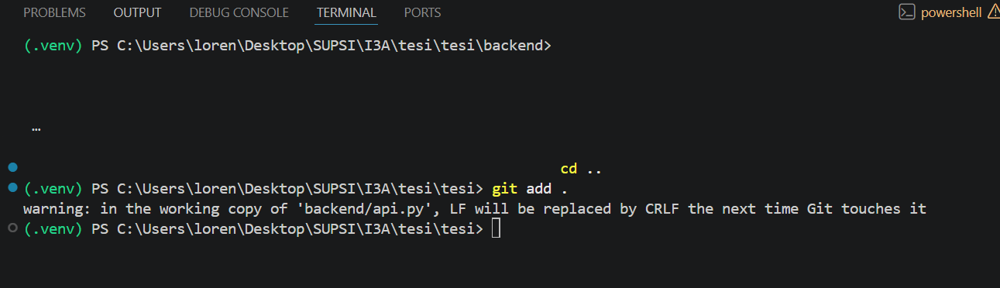

# ProgettoSemestre

Progetto Semestre SUPSI 2025/26

---

## Struttura del CSV

Il file ha esattamente **4 colonne** :

```
id,domanda,reale,alternative_json
```

| Colonna            | Tipo             | Significato                                                                |
| ------------------ | ---------------- | -------------------------------------------------------------------------- |
| `id`               | `int`            | Indice progressivo della domanda (`1..N`)                                  |
| `domanda`          | `str`            | Testo della domanda originale dal dataset BoolQ                            |
| `reale`            | `"true"`/`"false"` | Risposta corretta di BoolQ                              |
| `alternative_json` | JSON (string)    | Lista serializzata delle `RIPETIZIONI_PER_DOMANDA` alternative valutate    |

---

## Struttura di `alternative_json`

È una **lista JSON** lunga `RIPETIZIONI_PER_DOMANDA`.

- L'**indice 0** è sempre la domanda originale.
- Gli indici **`1..N-1`** sono le parafrasi prodotte da Ollama in sequenza (ogni parafrasi nasce dalla precedente).

Ogni elemento è un oggetto con 5 campi:

```json
{
  "domanda_alt":     "Will additional installments of Bee and PuppyCat be produced?",
  "risposta_pulita": "true",
  "p_true_raw":      0.999817930678194,
  "p_false_raw":     0.00017985425916999988,
  "p_altri_raw":     1.6143687038687492e-06
}
```

| Campo             | Significato                                                                              |
| ----------------- | ---------------------------------------------------------------------------------------- |
| `domanda_alt`     | Testo effettivo presentato al modello in questa ripetizione (originale o parafrasi)      |
| `risposta_pulita` | Classificazione `"true"` / `"false"` / `"altro"` decisa con `argmax(p_true_raw, p_false_raw)` |
| `p_true_raw`      | Massa di probabilità (somma) sui token top-10 che contengono `"true"`                    |
| `p_false_raw`     | Massa di probabilità (somma) sui token top-10 che contengono `"false"`                   |
| `p_altri_raw`     | Massa di probabilità sui restanti token del top-10 (non-true, non-false)                 |

> **Nota:** queste probabilità **non sono normalizzate**. 
>
> Quando serve una distribuzione vera (es. per il calcolo dell'entropia), `generatore_grafici.py` rinormalizza esplicitamente dividendo per la somma.

---

## Cosa viene derivato a tempo di analisi

Da queste sole 4 colonne, `generatore_grafici.py` ricostruisce:

- **Matrice di confusione "originale"** → da `alternative[0].risposta_pulita` vs `reale`
- **Matrice di confusione "varianti"** → da `alternative[1:].risposta_pulita` vs `reale`
- **Matrice di confusione "maggioranza"** → da `sum(p_true_raw)` vs `sum(p_false_raw)` su tutte le alternative
- **Distribuzione voti** (es. `"3-0"`, `"2-1"`) → conteggio dei `risposta_pulita`
- **Entropia binaria / ternaria** (min / max / avg / delta) → dai `p_*_raw`
- **Quartili di entropia, scatterplot, Pearson** → tutto dai `p_*_raw`


provare a fare i plot così
