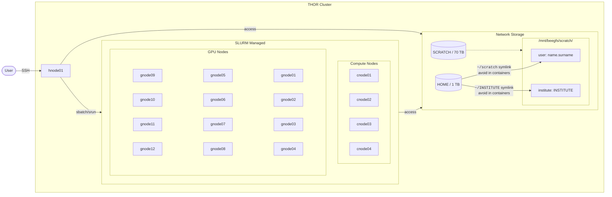
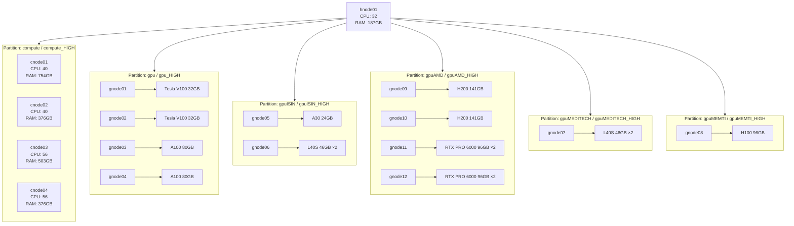

# THOR Cluster — Getting Started Guide

**Slurm 25 + Apptainer 1.4.2 (SUPSI HPC)**

This guide walks you from first login to running a multi-step GPU job. Read sections 1-5 in order if you're new; sections 6+ are reference material to come back to.

---

## 1. What is THOR?

THOR is a shared HPC cluster with both general-purpose and institute-specific resources. Two systems work together:

- **Slurm** — the resource manager. It allocates CPUs, RAM, and GPUs, and schedules your jobs across nodes.
- **Apptainer** — the container runtime. It packages Python, libraries, and CUDA into a reproducible `.sif` image so your code runs the same way everywhere.

```text
Slurm     = resources  (how much, on which node)
Apptainer = environment (what software, what versions)
```

Mental model:


---

## 2. Access and Storage

### 2.1 Connecting

```bash
ssh name.surname@thor.supsi.ch
```

Use your domain credentials. This lands you on **hnode01**, the headnode.

> ⚠️ **The headnode is for job submission only.** Do not run simulations, training, or any CPU/memory-intensive process directly here — submit a job instead. The headnode has 32 cores / 187GB RAM shared by everyone connected.

### 2.2 Where things live

| Location | Purpose | Size | Notes |
|---|---|---|---|
| `/home/<name.surname>/` | Scripts, configs, Git repos | 1 TB | Small files only |
| `/mnt/beegfs/scratch/<name.surname>/` | Datasets, `.sif` images, computation files, outputs | 70 TB shared pool | Also reachable via `/home/<name.surname>/scratch` |
| `/mnt/beegfs/scratch/<INSTITUTE>/` | Institute-shared resources | shared pool | Also reachable via `/home/<name.surname>/INSTITUTE` |

**Always use the real scratch path**, not the `/home/<name.surname>/scratch` symlink — it can cause inconsistent behavior inside containers. Bind and reference `/mnt/beegfs/scratch/<name.surname>` directly.

`/scratch` is **transient and not backed up**. It's for active computation, not archiving. Move anything you want to keep off the cluster when you're done with it.



A consistent example layout used throughout this guide:

```text
/home/name.surname/project1/          # scripts, sbatch files (git repo)
/mnt/beegfs/scratch/name.surname/project1/
    env1.sif                       # CPU image
    env2.sif                       # GPU image
    data/
    output/
```

---

## 3. Core Slurm Concepts

| Term | Meaning |
|---|---|
| Job | Unit of work submitted to Slurm |
| Allocation | Resources reserved for that job |
| Partition | A queue of nodes with shared limits |
| Task | A process within a job |
| `--cpus-per-task` | Threads/cores available to one task |

### The golden rule

```text
sbatch = resource allocation   (what you reserve)
srun   = resource consumption  (what you actually use, step by step)
```

Slurm does **not** manage parallelism inside your job for you — you're responsible for making sure your `srun` steps fit inside what `sbatch` requested.

- **Sequential steps:** allocation must cover the *largest single step*. `max(srun usage) ≤ sbatch allocation`
- **Parallel steps:** allocation must cover the *sum of concurrent steps*. `sum(srun usage) ≤ sbatch allocation`

| Pattern | Allocation strategy |
|---|---|
| Sequential steps | size for the heaviest step |
| Parallel steps | size for the sum of all concurrent steps |
| One job per task | size per task, submitted independently |

### Partitions available on THOR

| Partition | Type | Max Time | Priority |
|---|---|---|---|
| `compute` | CPU | 14 days | normal |
| `compute_HIGH` | CPU | 2 days | high |
| `gpu` | GPU (V100 / A100) | 14 days | normal |
| `gpu_HIGH` | GPU (V100 / A100) | 2 days | high |
| `gpuISIN` | GPU (A30 / L40S) | 14 days | normal |
| `gpuISIN_HIGH` | GPU (A30 / L40S) | 2 days | high |
| `gpuAMD` | GPU (H200 / RTX PRO 6000) | 14 days | normal |
| `gpuAMD_HIGH` | GPU (H200 / RTX PRO 6000) | 2 days | high |
| `gpuMEDITECH` | GPU (L40S) | 14 days | normal |
| `gpuMEDITECH_HIGH` | GPU (L40S) | 2 days | high |
| `gpuMEMTI` | GPU (H100) | 14 days | normal |
| `gpuMEMTI_HIGH` | GPU (H100) | 2 days | high |

`_HIGH` partitions get faster scheduling but cap job runtime at 2 days — use them for short, urgent jobs. Full node specs (CPU models, GPU compute capability, etc.) are in the [Hardware Reference](#8-hardware-reference) appendix.

---

## 4. Your First Job

### 4.1 Interactive session (recommended for testing)

Before writing a full batch script, get an interactive shell on a compute node to test commands live:

```bash
srun --partition=compute --cpus-per-task=2 --mem=4G --time=00:30:00 --pty bash
```

For a GPU node:

```bash
srun --partition=gpu --gres=gpu:1 --cpus-per-task=4 --mem=16G --time=00:30:00 --pty bash
```

You'll get a shell directly on the allocated node. Use this to sanity-check paths, container binds, and that your environment works before scaling up.

### 4.2 A minimal batch script

```bash
#!/bin/bash
#SBATCH --job-name=hello
#SBATCH --partition=compute
#SBATCH --cpus-per-task=2
#SBATCH --mem=4G
#SBATCH --time=00:10:00
#SBATCH --output=hello_%j.out
#SBATCH --error=hello_%j.err

srun apptainer exec /mnt/beegfs/scratch/name.surname/project1/env1.sif echo "Hello from $(hostname)"
```

- `%j` is replaced with the job ID, so each run gets its own output file.
- `--error` keeps stderr separate from stdout — helpful for debugging failed jobs without scrolling through normal logs.

Submit it:

```bash
sbatch hello.sh
```

You'll get back something like `Submitted batch job 12345`. That number is your **JobID**.

### 4.3 Estimating resources for your first job

You won't know exact requirements upfront — start conservative and check actual usage afterward:

```bash
sacct -j 12345 --format=JobID,State,Elapsed,MaxRSS,ReqMem,TotalCPU
```

Compare `MaxRSS` (actual peak memory used) to `ReqMem` (what you requested). If a job dies with `OUT_OF_MEMORY` or status `OOM`, raise `--mem` and resubmit. If `MaxRSS` is far below `ReqMem`, you're over-requesting and may wait longer in queue than necessary — scale down.

---

## 5. Apptainer Basics

### 5.1 Core idea

A `.sif` file is an **immutable** container image — it runs as your user and cannot be written to at runtime. Keep code outside the container (in `/home` or scratch) and only put the software stack (Python, libraries, CUDA) inside the image. This means you can edit code without rebuilding the container.


### 5.2 Getting an image

If you don't have a `.sif` yet, the fastest path is usually pulling an existing image from a public registry:

```bash
apptainer build /mnt/beegfs/scratch/name.surname/project1/env1.sif docker://python:3.10
```

Or build from a recipe file for more control:

```text
# my.def
Bootstrap: docker
From: python:3.10

%post
    pip install numpy torch

%runscript
    python script.py
```

```bash
apptainer build --remote my.sif my.def
```

For a private registry:

```bash
apptainer registry login docker.io
apptainer build my.sif docker://user/private-image:latest
```

### 5.3 Running

```bash
apptainer exec image.sif cmd          # run a command
apptainer shell image.sif             # interactive shell inside container
apptainer exec --nv image.sif cmd     # with GPU access (note: --nv, not -nv)
apptainer inspect image.sif           # see image metadata
```

### 5.4 Binding scratch

Always bind the real scratch path explicitly so paths resolve consistently inside the container:

```bash
apptainer exec \
  -B /mnt/beegfs/scratch/name.surname:/scratch \
  env1.sif python script.py
```

Or bind specific subfolders:

```bash
apptainer exec \
  -B /mnt/beegfs/scratch/name.surname/data:/data \
  -B /mnt/beegfs/scratch/name.surname/output:/output \
  env1.sif python script.py
```

---

## 6. Putting It Together: A Multi-Step Job

This example chains lightweight CPU steps and GPU steps in one job — a common pattern for fetch → train → infer → validate pipelines.

### Files

```text
/mnt/beegfs/scratch/name.surname/project1/env1.sif   # CPU tasks
/mnt/beegfs/scratch/name.surname/project1/env2.sif   # GPU tasks
```

### sbatch.sh

```bash
#!/bin/bash
#SBATCH --job-name=exampleGPU
#SBATCH --partition=gpu
#SBATCH --nodes=1
#SBATCH --ntasks=1
#SBATCH --cpus-per-task=8
#SBATCH --gres=gpu:1
#SBATCH --mem=64G
#SBATCH --time=02:00:00
#SBATCH --output=job_%j.out
#SBATCH --error=job_%j.err

SCRATCH=/mnt/beegfs/scratch/name.surname/project1

# Step 1: fetch data (lightweight, no srun needed)
./fetchData.sh

# Step 2: training (GPU)
srun apptainer exec --nv -B $SCRATCH:/scratch $SCRATCH/env2.sif \
     python train_model.py --train

# Step 3: prepare validation data (lightweight)
./prepareValidationData.sh

# Step 4: inference (GPU)
srun apptainer exec --nv -B $SCRATCH:/scratch $SCRATCH/env2.sif \
     python run_inference.py

# Step 5: validate results (lightweight)
./validateResults.sh
```

Submit with `sbatch sbatch.sh`.

### Execution flow

| Step | Command | Runs where | Notes |
|---|---|---|---|
| 1 | `./fetchData.sh` | launch node | No `srun`; lightweight, single-node |
| 2 | `srun ... train_model.py` | allocated GPU node | Uses the requested GPU + up to 8 cores |
| 3 | `./prepareValidationData.sh` | launch node | No `srun`; lightweight |
| 4 | `srun ... run_inference.py` | allocated GPU node | GPU inference |
| 5 | `./validateResults.sh` | launch node | Final aggregation |

**Why this allocation:** sequential execution means sizing for the *heaviest* step — here that's the GPU training/inference step (8 CPU, 64GB, 1 GPU) — not the sum of everything.

### Alternative: split into separate CPU and GPU jobs

If the CPU and GPU phases don't need to run back-to-back in one allocation, splitting saves resources and queue time, since the CPU job no longer reserves a GPU it isn't using:

```bash
# cpu_sbatch.sh — only requests what the CPU steps need
#SBATCH --cpus-per-task=2
#SBATCH --mem=6G
srun apptainer exec env1.sif ./task1.sh
srun apptainer exec env1.sif ./task2.sh
```

```bash
# gpu_sbatch.sh — only requests what the GPU steps need
#SBATCH --cpus-per-task=4
#SBATCH --mem=64G
#SBATCH --gres=gpu:1
srun apptainer exec --nv env2.sif python train_model.py
```

### Alternative: parallel steps

If steps are independent and can run concurrently, launch them in the background and `wait`. The allocation then needs the **sum** of their resources, not the max:

```bash
#SBATCH --ntasks=3
#SBATCH --cpus-per-task=2
#SBATCH --mem=6G

srun --cpus-per-task=1 --mem=1G apptainer exec env1.sif ./task1.sh &
srun --cpus-per-task=1 --mem=2G apptainer exec env1.sif ./task2.sh &
srun --cpus-per-task=2 --mem=3G apptainer exec env1.sif ./task3.sh &
wait
```

Total here: 4 CPUs (1+1+2), 6GB (1+2+3) — matching the `#SBATCH` request.

> ❗ **Oversubscription warning:** if you launch parallel `srun` steps whose combined CPU request exceeds your `#SBATCH` allocation, Slurm doesn't reject this outright — you'll get contention and slowdown as steps compete for the same cores. Always check that the sum fits.

---

## 7. Monitoring and Managing Jobs

```bash
squeue                          # all jobs in queue
squeue -u $USER                 # just yours
sinfo                           # partition/node overview
sinfo -N                        # per-node detail
sinfo -o "%P %D %C"             # cluster occupancy by partition
scontrol show job <jobid>       # full detail on one job
sacct -j <jobid>                # job steps + state
sacct -j <jobid> --format=JobID,State,Elapsed,MaxRSS
scancel <jobid>                 # cancel a job
```

`sacct` lists individual `srun` steps with their own StepID (e.g. `12345.0`, `12345.1`). Commands run *without* `srun` show up as part of the overall batch step but won't have separate resource accounting.

### Checking free GPUs

Save this as `slurm-gpu-free.sh`:

```bash
#!/usr/bin/env bash
scontrol show nodes | awk '
/NodeName=/ { node=$1; parts="unknown"; type=""; total=0 }
/Partitions=/ { match($0, /Partitions=([^ ]+)/, p); parts=p[1] }
/Gres=gpu/ { match($0, /gpu:([^:]+):([0-9]+)/, t); type=t[1]; total=t[2] }
/AllocTRES=/ {
  match($0, /gres\/gpu=([0-9]+)/, g)
  match($0, /gres\/mps=([0-9]+)/, m)
  used_gpu = (g[1] ? g[1] : 0)
  used_mps = (m[1] ? m[1] : 0)
  if (total > 0) {
    if (used_gpu > 0) { free = total - used_gpu; status = free "/" total " GPUs free" }
    else if (used_mps > 0) { status = (used_mps >= 100) ? "MPS FULL" : "MPS " used_mps "% used" }
    else { status = total "/" total " GPUs free" }
    printf "%-18s %-25s %-6s %s\n", node, parts, type, status
  }
}'
```

Sample output:

```text
NodeName=gnode01   gpu_HIGH,gpu              v100   0/1 GPUs free
NodeName=gnode02   gpu_HIGH,gpu              v100   1/1 GPUs free
NodeName=gnode03   gpu_HIGH,gpu              a100   1/1 GPUs free
NodeName=gnode05   gpuISIN_HIGH,gpuISIN      a30    MPS FULL
```

### Common job states (`sacct` / `squeue`)

| State | Meaning |
|---|---|
| `PD` (PENDING) | Waiting for resources or queue priority — check `scontrol show job <id>` for the `Reason` field |
| `R` (RUNNING) | Currently executing |
| `CD` (COMPLETED) | Finished successfully |
| `F` (FAILED) | Non-zero exit code — check your `.err` file |
| `OOM` | Killed for exceeding requested memory — raise `--mem` |
| `TIMEOUT` | Hit `--time` limit — raise it or optimize the job |
| `CANCELLED` | Manually cancelled, or killed by an admin/limit |

---

## 8. Hardware Reference

Full node specs — useful once you're choosing a partition for a specific workload, not needed for your first job.



| Hostname | CPU | Cores (Total) | RAM (GB) | GPU Model(s) | GPU Mem (GB) | Arch | CC | CUDA Target | Partition(s) |
|---|---|---|---|---|---|---|---|---|---|
| hnode01 | 2× Xeon Gold 5218 @ 2.30GHz | 16 (32) | 187 | None | — | — | — | — | — |
| cnode01 | 2× Xeon Gold 6248 @ 2.50GHz | 20 (40) | 754 | None | — | — | — | — | compute, compute_HIGH |
| cnode02 | 2× Xeon Gold 6248 @ 2.50GHz | 20 (40) | 376 | None | — | — | — | — | compute, compute_HIGH |
| cnode03 | 2× Xeon Gold 6258R @ 2.70GHz | 28 (56) | 503 | None | — | — | — | — | compute, compute_HIGH |
| cnode04 | 2× Xeon Gold 6258R @ 2.70GHz | 28 (56) | 376 | None | — | — | — | — | compute, compute_HIGH |
| gnode01 | 2× Xeon Gold 6248 @ 2.50GHz | 20 (40) | 754 | Tesla V100-PCIE-32GB | 32 | Volta | 7.0 | sm_70 | gpu, gpu_HIGH |
| gnode02 | 2× Xeon Gold 6248 @ 2.50GHz | 20 (40) | 376 | Tesla V100-PCIE-32GB | 32 | Volta | 7.0 | sm_70 | gpu, gpu_HIGH |
| gnode03 | 2× Xeon Gold 6348 @ 2.60GHz | 28 (56) | 502 | A100 80GB PCIe | 80 | Ampere | 8.0 | sm_80 | gpu, gpu_HIGH |
| gnode04 | 2× Xeon Gold 6348 @ 2.60GHz | 28 (56) | 502 | A100 80GB PCIe | 80 | Ampere | 8.0 | sm_80 | gpu, gpu_HIGH |
| gnode05 | 2× Xeon Gold 6258R @ 2.70GHz | 28 (56) | 376 | NVIDIA A30 | 24 | Ampere | 8.0 | sm_80 | gpuISIN, gpuISIN_HIGH |
| gnode06 | 2× Xeon Gold 6542Y @ 2.90GHz | 24 (48) | 502 | 2× L40S | 46 each | Ada Lovelace | 8.9 | sm_89 | gpuISIN, gpuISIN_HIGH |
| gnode07 | 2× Xeon Gold 6542Y @ 2.90GHz | 24 (48) | 502 | 2× L40S | 46 each | Ada Lovelace | 8.9 | sm_89 | gpuMEDITECH, gpuMEDITECH_HIGH |
| gnode08 | 2× AMD EPYC 9654 @ 2.40GHz | 96 (192) | 1502 | H100 | 96 | Hopper | 9.0 | sm_90 | gpuMEMTI, gpuMEMTI_HIGH |
| gnode09 | 2× AMD EPYC 9654 @ 2.60GHz | 96 (192) | 1102 | H200 | 141 | Hopper | 9.0 | sm_90 | gpuAMD, gpuAMD_HIGH |
| gnode10 | 2× AMD EPYC 9654 @ 2.60GHz | 96 (192) | 1102 | H200 | 141 | Hopper | 9.0 | sm_90 | gpuAMD, gpuAMD_HIGH |
| gnode11 | 2× AMD EPYC 9655 @ 2.60GHz | 96 (192) | 1102 | 2× RTX PRO 6000 | 96 each | Blackwell | 12.0 | sm_120 | gpuAMD, gpuAMD_HIGH |
| gnode12 | 2× AMD EPYC 9655 @ 2.60GHz | 96 (192) | 1102 | 2× RTX PRO 6000 | 96 each | Blackwell | 12.0 | sm_120 | gpuAMD, gpuAMD_HIGH |

---

## 9. Common Pitfalls

**Slurm**
- Oversubscribing CPUs across parallel `srun` steps (sum exceeds allocation)
- Forgetting `--mem` and getting OOM-killed
- Submitting to the wrong partition for your hardware needs

**Apptainer**
- Forgetting `--nv` on GPU jobs (job runs but can't see the GPU)
- Forgetting to bind the data path you need (`-B`)
- Trying to write to the `.sif` file itself — it's read-only; write to a bound scratch path instead

**Filesystem**
- Using `$HOME` for heavy I/O (slow, and not what it's for)
- Using `/home/<user>/scratch` (symlink) instead of `/mnt/beegfs/scratch/<name.surname>` (real path) inside containers

---

## 10. Quick Reference Cheat Sheet

```bash
# Submit / monitor / cancel
sbatch job.sh
squeue -u $USER
sacct -j <jobid> --format=JobID,State,Elapsed,MaxRSS
scancel <jobid>

# Common SBATCH flags
--cpus-per-task=4
--mem=8G
--gres=gpu:1
--time=02:00:00
--partition=gpu

# Apptainer
apptainer exec image.sif cmd
apptainer exec --nv image.sif cmd
apptainer exec -B /mnt/beegfs/scratch/name.surname:/scratch image.sif cmd

# Golden rules
# - Slurm = resources, Apptainer = environment
# - Sequential steps -> size for the max
# - Parallel steps    -> size for the sum
# - Always bind scratch explicitly; never rely on the home symlink
# - Code outside the container, software stack inside
```


